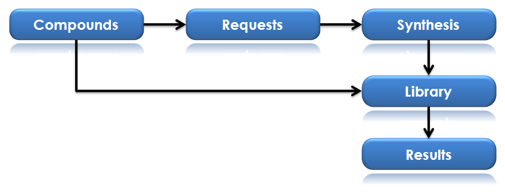
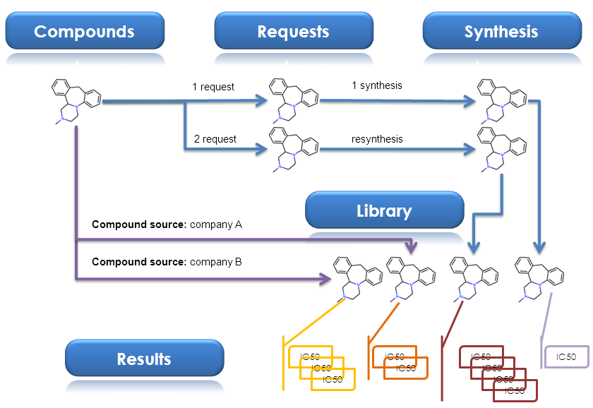

.. _Workflow:

**********************************
Project Workflow Overview
**********************************

Describe the workflow general schemes associated with a project.

 .. _multiprojects:

Multiproject
===============================================================

* MolGears allows you divide your work into projects. The solution is designed to handle project management for small compounds.
* Molgears allows you to manage access and grant authorized users  the right to use the service and access permision for each project independly.
* In addition each project has basic workflow divided into tasks: 
   * designing process, 
   * ordering synthesis,
   * tracking sythesis process,
   * storage compound in library,
   * result tool for compounds activity.
 
 .. _basic-workflow:
 
Project basic workflow
===============================================================

* A repeatable process that brings similar stages each time
* A clear division of responsibility between different people
* A better basis to estimate task length
* A simple method to communicate process and data to all or selected teem members/employees/colabollators/
* Each task has history records so you can see who added, approved and edited each record.

Basic Workflow Schema
-------------------------------------------------------------------------------------------------------------------------------
For each project in menu bar you have access to 5 main tables connected to the project workflow.

* Compounds - root table. Storage for molecules structures; both: ideas and existing compounds. Unique records for each structure.
* Requests - put ideas into real things. Table for synthesis requests.
* Synthesis - table for tracking synthesis progress, priority managing, and analytical data storage.
* Library - table only for existing compounds. The library of compounds with ability for tracking location and the amount of compound.
* Results - compound activity data storage connected to library instance. It's allowed to add for one library record many results.

**Workflow schema for the tables:**

\I. Add structures to Compounds table.

\II. You can choose two path:

    1. Internal synthesis:
    
        a. Create synthesis request
        b. Accept synthesis by chemist and proceed synthesis phases
        c. Add finished compound from synthesis to library
        
    2. External synthesis (e.g. you're buying ready product):
        
        a. Accept compound directly to library
        
\III. Add one or more activity results to library instance.
    

 
Example for the various sources of sample
-------------------------------------------------------------------------------------------------------------------------------
Compounds table is containing unique structures of molecules. This means you can't add the same structure twice to Compounds Table.
Only exception for this rule is adding compound as isomer. **[references]**. This rule also don't apply to other tables. 
You can create many request for one compound (structure) and then accept them to synthesis. One of the example of using this mechanism is
performing synthesis of small amount of some compound. Later when we need more we can order the resynthesis by putting the same
compound second time into request and follow the workflow once again.
 
Separate case is when you don't want to carry out the synthesis procedure and want to add a compound directly to the library
e.g. when you're buying ready product from *company A*. Then follow the second path in workflow (see :ref:`basic-workflow`).
But you can also add this like that many times. If you add this twice and earlier when you performed 2 synthesis procedure as a result you will
have 4 instances in library table referenced for the same structure. Than you can add one or more activity results independently for each of library
instance of your compound. The shema illustrating this is presented below:

